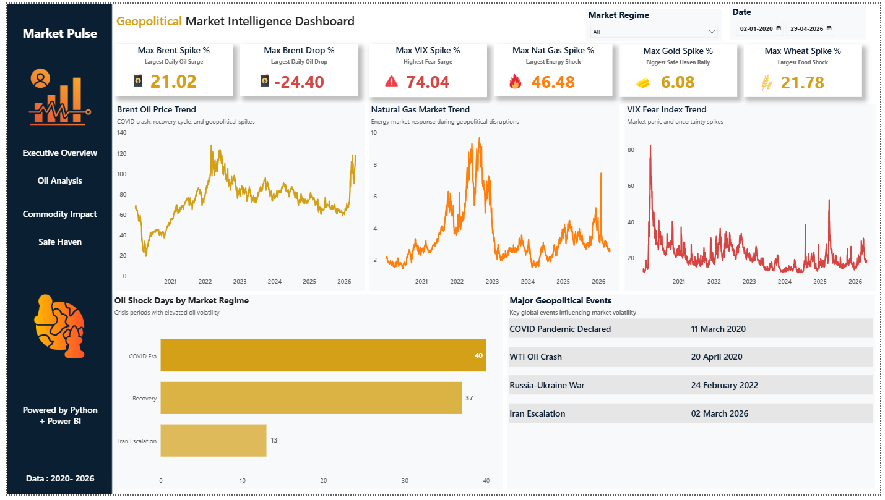
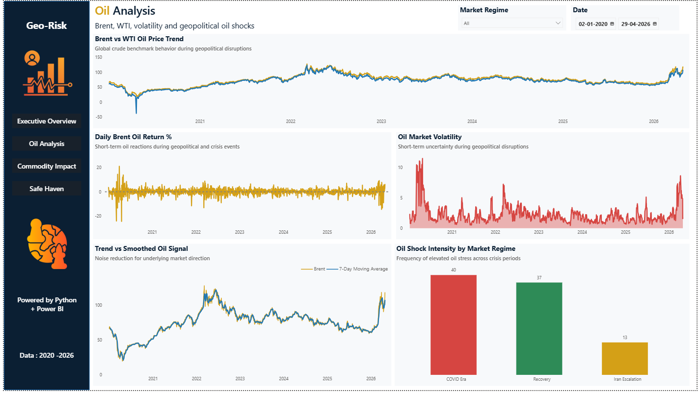
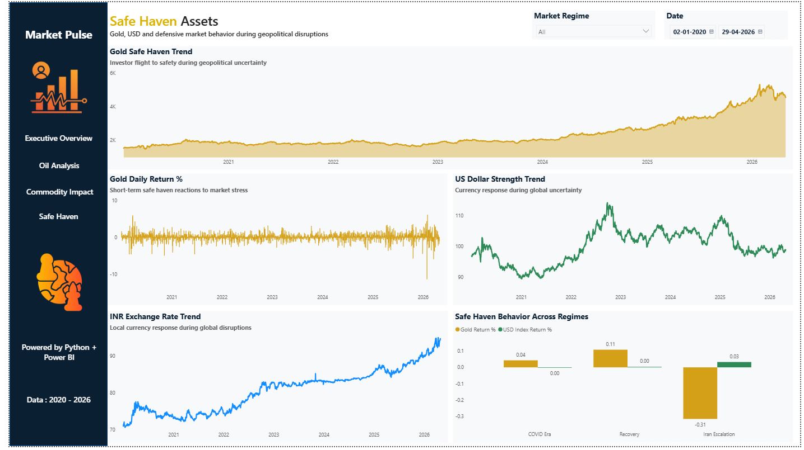

# Geopolitical-Market-Intelligence-dashboard

Geopolitical-Market-Intelligence-dashboard is a multi-page Power BI dashboard designed to analyze how geopolitical disruptions impact global financial markets, commodities, and safe-haven assets.

The dashboard tracks the market response during major global events including:

- COVID-19 Pandemic
- WTI Oil Crash (2020)
- Russia–Ukraine Conflict
- Iran Escalation (2026)

By combining energy, commodity, volatility, and safe-haven indicators, the dashboard provides a comprehensive view of market behavior during periods of uncertainty.

## Business Objective

To understand how geopolitical shocks influence:

- Oil prices
- Market fear and volatility
- Commodity markets
- Safe-haven assets
- Currency movements

and identify patterns across different market regimes.

## Tools & Technologies
- Python
- Pandas
- Power BI
- DAX
- Yahoo Finance API
- Jupyter Notebook

## Data Sources

Market data collected from Yahoo Finance:

- Brent Crude Oil
- WTI Crude Oil
- VIX Index
- Gold
- USD Index
- INR/USD
- Natural Gas
- Wheat
- Copper

## Data Engineering & Feature Creation

Performed using Python and Pandas:

- Data Preparation
- Data acquisition from Yahoo Finance
- Date alignment and merging
- Missing value handling
- Feature engineering
- Market regime classification
- Derived Metrics
- Daily Returns
- Rolling Volatility
- Moving Averages
- Shock Detection Indicators
- Regime-Based Aggregations

## Dashboard Pages
1. Executive Overview
Provides a high-level summary of market conditions.

Highlights

- Maximum Brent Oil Spike
- Maximum Brent Oil Drop
- Maximum VIX Spike
- Maximum Natural Gas Spike
- Maximum Gold Spike
- Maximum Wheat Spike
- Brent Oil Trend
- Natural Gas Trend
- VIX Trend
- Major Geopolitical Events
- Oil Shock Days by Regime

2. Oil Analysis
Detailed analysis of crude oil behavior.

Highlights

- Brent vs WTI Price Trend
- Daily Brent Returns
- Oil Market Volatility
- Brent Moving Average Analysis
- Oil Shock Intensity by Regime

3. Commodity Impact Analysis
Tracks commodity reactions during geopolitical disruptions.

Highlights

- Natural Gas Trend
- Natural Gas Returns
- Wheat Trend
- Copper Trend
- Commodity Stress by Regime

4. Safe Haven Assets
Analyzes investor flight-to-safety behavior.

Highlights

- Gold Trend
- Gold Daily Returns
- USD Index Trend
- INR Exchange Rate Trend
- Safe Haven Behavior Across Regimes

## Key Insights
# Oil Markets
- Brent experienced a maximum daily surge of 21.02%.
- Largest daily decline reached -24.40%.
- Volatility
- VIX recorded a peak increase of 74.04%, indicating extreme market fear.
  
# Commodities
- Natural Gas showed the strongest energy shock response.
- Wheat experienced significant supply-chain related price spikes.
- Copper reflected industrial demand sensitivity during uncertainty.
  
# Safe Haven Assets
- Gold consistently attracted capital during periods of elevated uncertainty.
- USD strengthened during risk-off environments.
- INR weakened against the USD during major global disruptions.

## Dashboard Preview

### Executive Overview

### Oil Analysis

### Commodity Impact Analysis

### Safe Haven Assets

## Project Outcomes

This project demonstrates:

- End-to-end data analysis
- Financial market analytics
- Time-series analysis
- Feature engineering
- Power BI dashboard development
- Storytelling with data
- Geopolitical market intelligence

## Author

Anburaj R

Aspiring Data Analyst | Python | SQL | Power BI | Tableau
